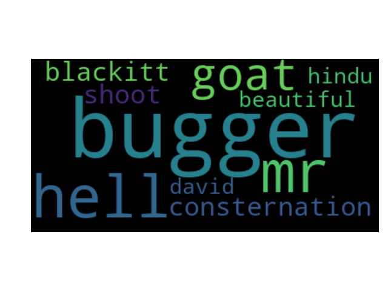
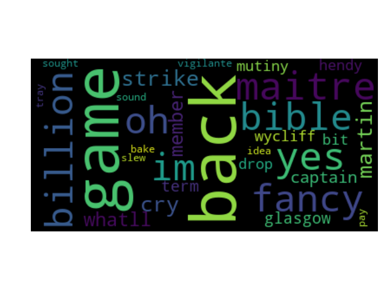
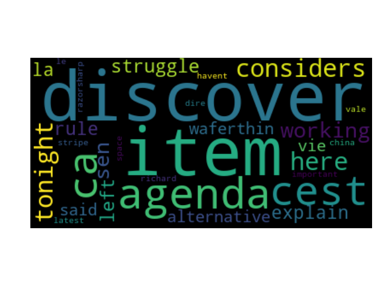
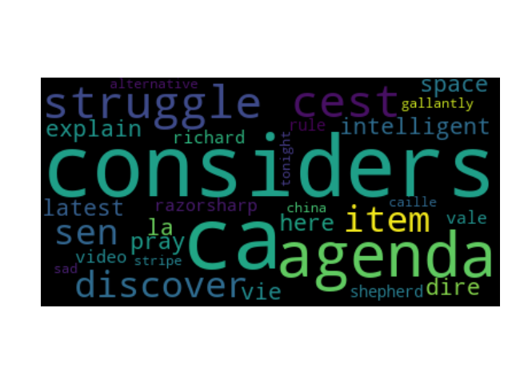
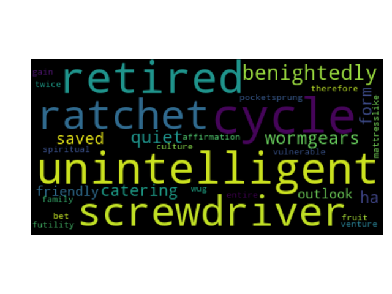
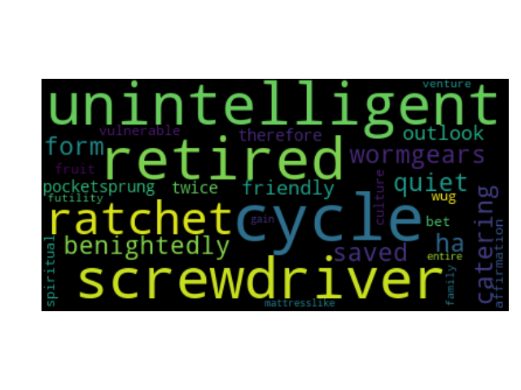
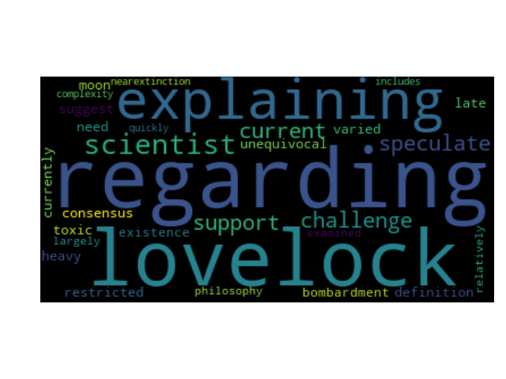
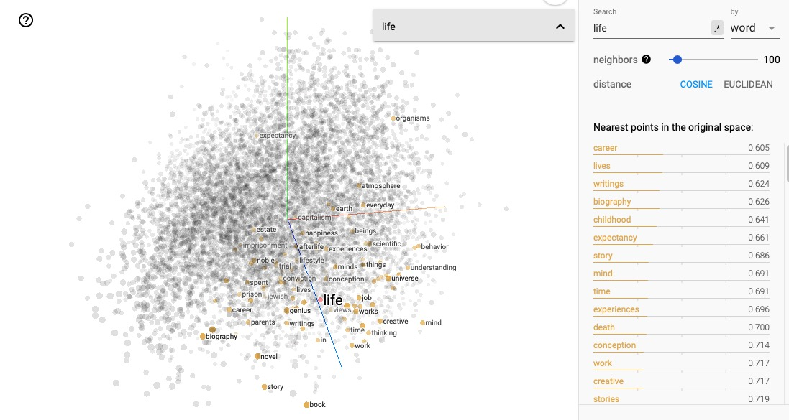
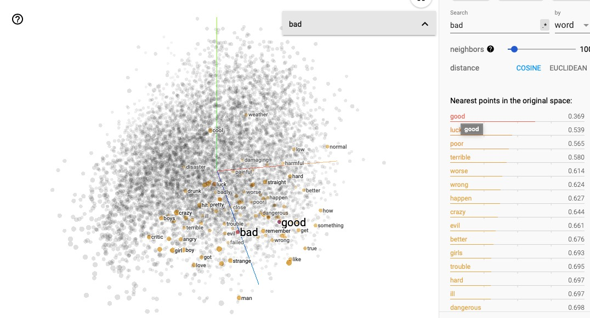

# Searching for the Meaning of Life...

The idea behind word embeddings is that words similar in meaning appear in similar contexts. Hence, one can infer a meaning of a word by looking at what other words appear in similar places in text corpora. 

Well, let's test what does the Word2Vec model has to offer us with regards to inferring the meaning of _life_. 

## Idea

- Generate word embeddings for Monty Python's 'The Meaning of Life' and Douglas Adams' 'Life, the Universe, and Everything' (using gensim' Word2Vec implementation)
- Display and visualise most similar words to the word 'life'. 
- Compare to the Word2Vec word embeddings trained on billions of news articles

## Data Processing
- Remove : 
    - punctuation
    - white spaces
    - numbers and other unwanted characters
    - stopwords (nltk)
- Stem words or/and lemmatise words 

## Word Vectors

Gensim library provides an easy way to calculate word vectors for a text. I used the default setting for the Word2Vec class, which include:
- number of dimensions: 100
- window size: 5
- training algorithm (sg): CBOW
- number of iterations over the corpus: 5

I stored the resulted word vectors in a binary file so that I don't need to calculate the vectors each time I use them. 

Then I asked THE question: what are the most similar vectors to the word 'life'. I visualised the answer in form of a word cloud, where word vectors where the font size corresponds to cosine similarity. 

### Monty Python's _The Meaning of Life_

Monty Python's 'The Meaning of Life' suggested that 'life' is most similar to... bugger, hell, and goat.

I increased the default number of similar vectors, which is 10, to 30. And this is where things got interesting: I received completely different results. 

The thing is, there is a great deal of randomisation in initialisation and training in the Word2Vec algorithms (CBOW and skip-gram), and the algorithms are also sensitive to order-of-presentation. Therefore, if I delete the created word vectors and create them again, I get different similar words. 

I've tweaked the parameters until I arrived at the following configuration: 

- only use one worker thread (still fast training for such small dataset)
- increase the number of iterations from 5 to 50
- increase the number of dimensions from 100 to 300
- start and keep the learning rate at 0,25
- specified the seed for random number generator

    	model = Word2Vec(sentences, alpha=0.025, size=300, min_alpha=0.025,
    					 min_count=1, seed=1, workers=1, iter=50)

With these, the model delivered consist results. The difference is mostly in the colours with which wordcloud visualises the words. 

Let us once more tweak a parameter and see if skip-gram will perform any different from CBOW (it should arrive at the same result, even though the algorithms are quite the opposite of each other). Indeed, the resutls are not identical, but very similar. 

Well, so what is the meaning of 'life', then? 

**Discover, consider, agenda, struggle**: these are quite decent world views parallels to _life_.
Well, there is naturally also some garbage such as _ca_, probably due to some pre-processing failures.

### Douglas Adams' _Life, the Universe, and Everything_

Let's compare the performance of CBOW and skip-gram. The parameters are just the same as with the last example. CBOW is the default algorithm, therefore it is not explicitly specified. 

    alpha=0.025, size=300, min_alpha=0.025,
					 min_count=1, seed=1, workers=1, iter=50
					 

Note: *unintelligent* is the second most similar word. In Monty Python's _The Meaning of Life_ *intelligent* was in the top 10. 

*Cycle* is the most similar word, which is quite astonishing: life _is_ a cycle, isn't it? Dr.Who fans will also be chuffed to see _screwdriver_ as the 4th most similar word.

Will skip-gram produce similar results? We just need to set `sg=1` as a parameter of `Word2Vec`, and we're good to go. 

Yes, same results.

### _Wikipedia's_ Article on Life

The top meaningful results are *lovelock*, *explaining*, *challenge*, *scientist*. It seems to be a common theme that words such as *struggle* and *challenge* are included. 

Enough word clouds. Let's try visualising with [Tensorflow Projector](https://projector.tensorflow.org). 
I couldn't get my own vectors loaded into the projector, therefore we will only take a look what pre-trained word embeddings have to say about our little quest for the meaning of _life_.

Word2Vec All tensor, which consists of around 70K words and 200 dimensions reckons that *career*, *biography*, *childhood* are all similar in their memaning to _life_:

Note that _death_ is also part of it. To me, this is a natural consequence of the algorithms placing words in a vector space based on the words they appear next to. 

To illustrate this phenomenon, let us look at the nearest neighbours of the word _bad_. I would expect that he word _good_ would be very closely positioned.

Indeed, good is distributionally most similar to _bad_.

## Conclusion

What have we learned?

_Life_ and _discover_ are similar in meaning, but so are _life_ and _hell_ or _life_ and _struggle_. 

I have also learned how to train my own word vectors on small datasets, tweak Word2Vec parameters to get consistent results. CBOW and skip-gram did indeed arrive at identical representations. 
I have also created a bunch of word clouds to visually represent the most similar words and explored tensor flow projector.

## Future Work

Generate correct .tsv files to upload to the Tensorflow Projector and to visualise own word vectors in the Tensorflow Projector.
