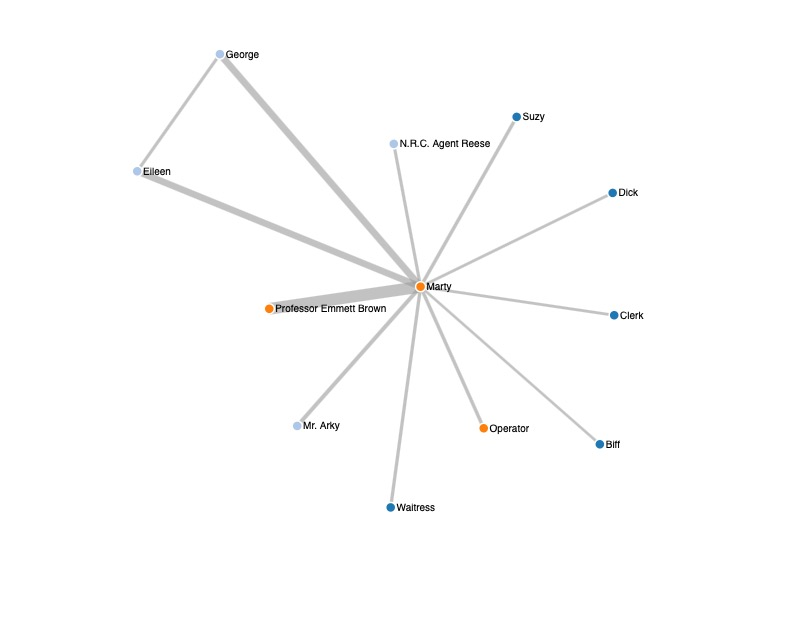
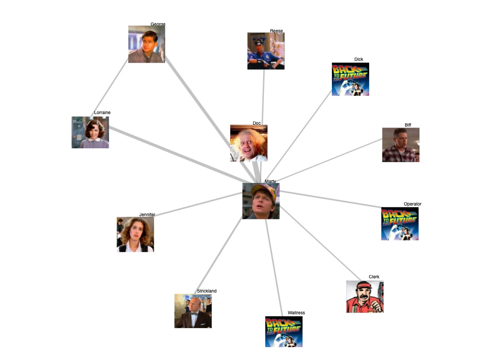
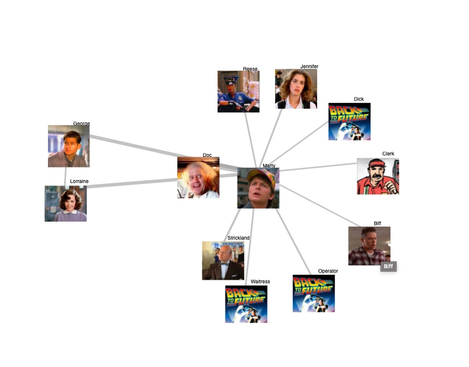
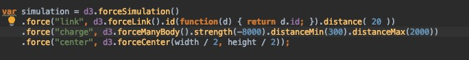
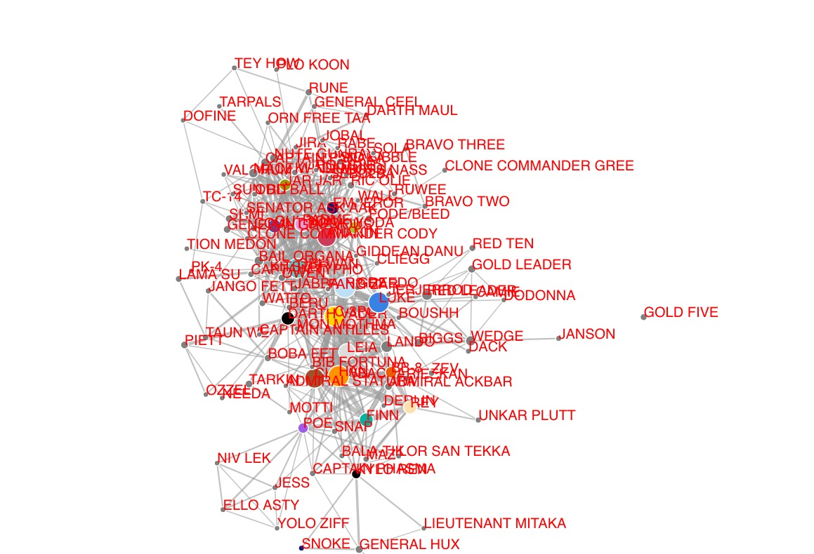
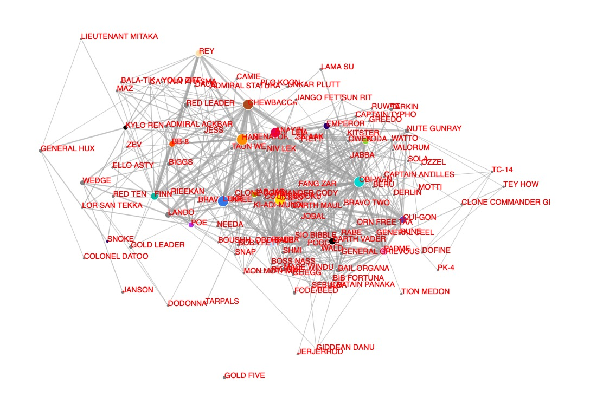

# Network Graphs, Pictures and a bit of Zoom

## Idea

Network graph of a movie: who is in how many scenes with whom. Use d3. 

## Data

[Kaggle dataset of movie scripts](https://www.kaggle.com/Cornell-University/movie-dialog-corpus)  
[Kaggle Star Wars movies](https://www.kaggle.com/xvivancos/star-wars-movie-scripts)

## Implementation

**Step One**: hunt for a dataset. For some unknown reason the past me has decided that the _Back to the Future_ movie script is a great idea. 

**Step Two**: Clean data and look for d3 implementations similar to what I have in mind.
The first draft of the network graph seemed unforgivingly boring. 
The main character, Marty, is in the center of the graph. Almost every other character has interactions only with him. Why on earth did I choose _Back to the Future_?

But I decided to get the most out of it and see if there is anything I can get out of it. I stumbled upon [this graph] (http://bmdata.co.uk/simpsons/) of Simpsons. 

The thickness of lines corresponds to the number of scenes together. The proximity between characters is attempting to how related VS. unrelated the characters are in the movie.

The I started changing mostly the forceLink() and forceManyBody() parameters. 
I decided to stop tweaking the parameters at this point: 

Then I finally gave in: there is not much more I can do with the _Back to the Future_ data. And started the hunt for better data again.
Star Wars is not that creative, but at least there are many characters talking to many other characters. From here on I use [this dataset of star wars movies](https://www.kaggle.com/xvivancos/star-wars-movie-scripts).

The code does not do much more, but there is so much more going on in the graph.

Well, that's a start. Let's add some zoom:

That's just a beginning. Getting familiar with the library has been a lot of fun but rather time-consuming. Therefore, I will leave this project as a rough draft for now. There is, however, so much more one can do!

## What else could we do?

- One could make more circles appear the more you zoom in, and that the larger circles slowly fade when zooming. 

- Create a Word grid with words in between characters that often appear in their respective conversations
- Group by species
- Group by country of origin
