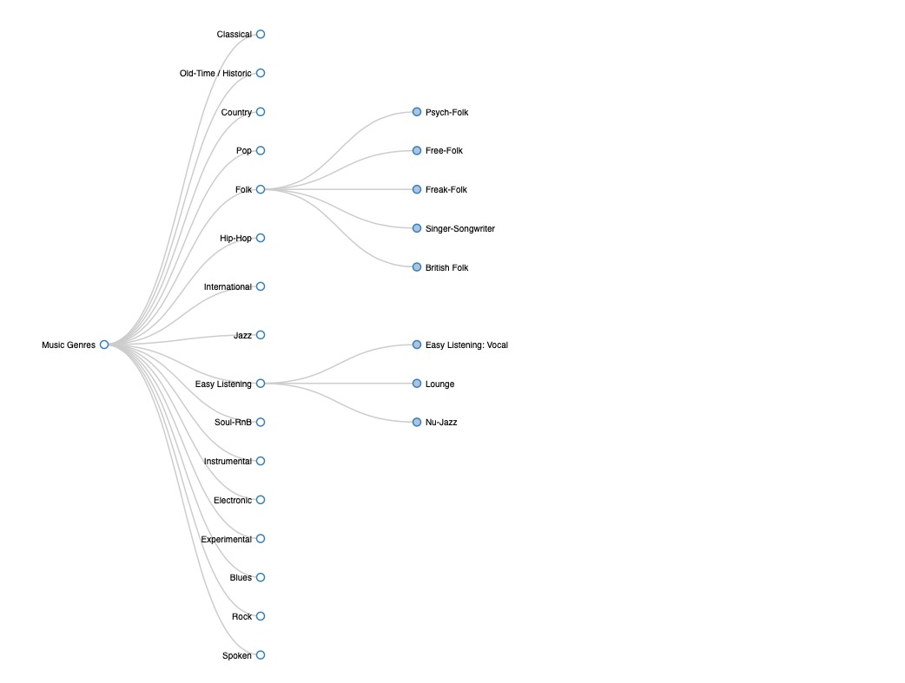

# Music Genres in d3

----
Click on the image to open the interactive visualisation:

## Idea

I decided to focus on visualising a knowledge graph in an interactive way as well as extracting data automatically. 

[This visualisation](http://bl.ocks.org/fabiovalse/d784198bdc1c76221393) seemed interesting, so I looked for an appropriate dataset. I ended up using a dataset of metadata for many songs from all kinds of music genres. 

## Data

Benzi, K., Defferrard, M., Vandergheynst, P., & Bresson, X. (2016). FMA: A dataset for music analysis. arXiv preprint arXiv:1612.01840.

Dataset available for download here: https://github.com/mdeff/fma

If you encounter troubles with unzipping the dataset (as I did), you can you a Python library `zipfile`

## Implementation

I extracted the relevant columns with information on `genre_id`, `genre title` and `parent genre` if applicable.   
Then I created a dictionary where I looked first for genres that have no parents. And then added the genres that have them as parents.

Then I adjusted the code so that it works with my data. 

## What have we learnt

On one hand, I have learnt more about the d3 library and its possibilities. On the other hand, it was neat to see the genres well-organised and the sub-genres.

## Future Work

I have stumbled upon [this elaborate visualisation of music genres](https://musicmap.info) with infoboxes that are shown once you click on a genre, and much more. It's overall a far larger project idea, but a beautiful one! 
